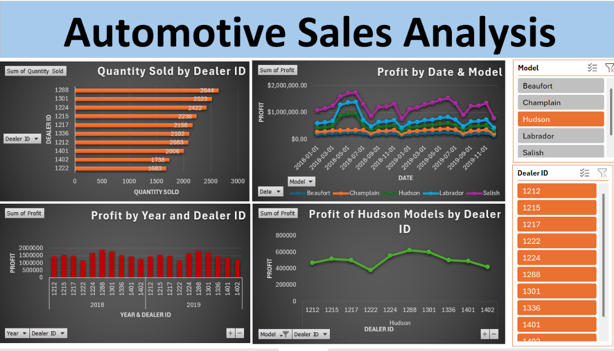

# 🚗 Automotive Sales Performance Analysis (Excel Dashboard Project)

## 📌 Project Overview

This project analyzes automotive dealership sales data using Microsoft Excel to identify key trends in sales performance, profitability, and dealership efficiency. The goal is to transform structured transactional data into meaningful business insights that support data-driven decision-making in the automotive retail industry.

---

## 📂 Data Source

The dataset used in this project is a sample dataset provided by IBM as part of a data analytics learning exercise. It contains automotive sales data across multiple dealers, car models, and time periods.

---

## 📊 Business Problem

An automotive retail organization with multiple dealerships wants to improve decision-making using data. However, they lack clear visibility into:

- Dealer-wise sales and profitability performance  
- High-performing and low-performing car models  
- Profit and sales trends over time  

This analysis was performed to help identify performance gaps, optimize inventory distribution, and improve overall profitability.

---

## 🎯 Objectives

The primary objectives of this project are:

- Analyze vehicle sales distribution across dealers  
- Evaluate profitability by car model and dealership  
- Identify yearly sales and profit trends  
- Compare dealer performance to highlight top and underperforming locations  
- Build clear visual dashboards for business decision-making  

---

## 🛠 Tools & Technologies Used

- Microsoft Excel (Excel for Web / Desktop)  
- Pivot Tables  
- Pivot Charts  
- Data Visualization  
- Data Aggregation and Summarization  

---

## 📌 Key Metrics (KPIs)

- Total Vehicles Sold  
- Total Profit  
- Average Profit per Vehicle  
- Top Performing Dealer  
- Most Profitable Car Model  

---

## 📈 Key Analyses Performed

- Quantity of vehicles sold by Dealer ID  
- Profit trends by Date and Car Model  
- Annual profit comparison across dealers  
- Performance of Hudson model cars across dealerships  
- Dealer-wise profitability comparison  

---

## 📊 Visualizations Created

- Bar Chart: Quantity Sold by Dealer ID  
- Line Chart: Profit by Date and Car Model  
- Column Chart: Profit by Year and Dealer ID  
- Line Chart: Profit of Hudson Models by Dealer ID  

These visualizations help identify sales patterns, profitability trends, and performance differences across dealerships.

---

## 📊 Dashboard Preview

---

## 🔍 Key Insights

- Sales performance varies significantly across dealerships, indicating uneven distribution of demand.  
- Certain car models consistently generate higher profit margins than others.  
- Profit trends fluctuate across years, indicating changes in demand or market conditions.  
- A small number of dealerships contribute disproportionately to overall revenue and profit.  

---

## 💡 Business Recommendations

- Increase inventory allocation for high-performing car models to maximize profitability  
- Provide targeted support and training for underperforming dealerships  
- Optimize pricing strategies for low-margin models  
- Focus marketing efforts on high-performing regions and dealers  
- Continuously monitor yearly performance trends for strategic planning  

---

## 📈 Project Outcome

This analysis provides actionable insights into dealership performance and product profitability. It helps stakeholders identify high-performing dealers, optimize inventory allocation, and improve overall revenue strategy across the automotive network.

---

## 📁 Repository Structure
Automotive-Sales-Analysis/
│
├── Automotive Sales Analysis.xlsx # Excel analysis file (Pivot Tables & Charts)
├── Automotive Sales Dashboard.png # Final dashboard visualization
├── README.md # Project documentation

---

## 🚀 Skills Demonstrated

- Data Analysis using Excel  
- Pivot Tables & Pivot Charts  
- Business Data Interpretation  
- KPI Development  
- Data Visualization & Dashboard Design  
- Analytical Thinking  
- Business Insight Generation  

---

## 👤 Author

**Nithish Sunkara**    
LinkedIn: https://linkedin.com/in/nsunkara01/